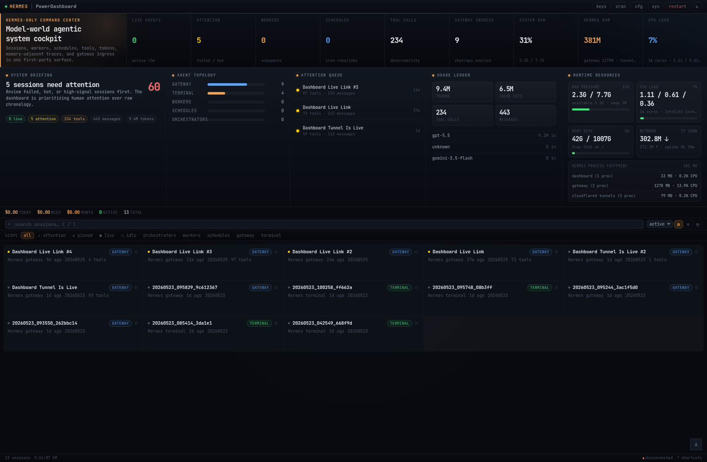

# ⚡ Hermes PowerDashboard

<p align="center">
  <strong>A cinematic, real-time mission-control dashboard for Hermes Agent.</strong><br/>
  One focused chat surface, live session intelligence, workers, schedules, tool traces, tokens, costs, and system health — all in one self-hosted cockpit.
</p>

<p align="center">
  
</p>

<p align="center">
  <a href="#quick-start"></a>
  
  
  
</p>

---

## Why this exists

Hermes Agent is powerful, but power users need more than a terminal and scattered chat logs.

**Hermes PowerDashboard** turns Hermes into a visual control room:

- See what Hermes is doing right now
- Open the current assistant conversation as a proper chat UI
- Inspect tool calls, tokens, cost, schedules, workers, and runtime pressure
- Debug sessions without digging through SQLite or logs
- Run it locally with zero build step

---

## Highlights

### 💬 One primary Hermes chat

The default dashboard view focuses on **one current Hermes conversation** — not a noisy archive of old Telegram/CLI sessions.

- Auto-opens the primary chat
- Chat-first transcript layout
- Multiline command composer
- Enter to send, Shift+Enter for newline
- Tool traces preserved as secondary diagnostics
- Full archive still available through debug/API scope

### 🧠 Agentic cockpit

A first-viewport command center for Hermes operations:

- Live agents / active work
- Attention queue
- Worker/subagent count
- Cron schedule visibility
- Gateway ingress
- Tool-call volume
- Token and cost telemetry
- Usage/model ledger

### 🖥️ Runtime resource monitor

Built-in local machine health:

- RAM
- CPU
- Disk
- Network
- Hermes process footprint
- Dashboard/gateway/tunnel process visibility

### 🔎 Session intelligence

For each session/mission:

- Role classification: orchestrator, worker, schedule, gateway, terminal
- Status: running, idle, completed, attention
- Recent activity
- Tool calls and results
- Token/cost breakdown
- Transcript drilldown
- Copy/export controls

### 🌓 Dark + light themes

A polished theme toggle is built into the header and settings panel:

- Dark command-center mode by default
- Clean light observability deck for daytime use
- Remembers your choice in `localStorage`
- Respects system light/dark preference on first load

### 📱 Responsive UI

Designed to feel good on desktop, tablet, and phone:

- Desktop: cockpit + right-side chat drawer
- Tablet/mobile: full-screen chat surface
- Safe-area-aware composer
- Touch-friendly controls
- Dark and light high-contrast operator aesthetics

---

## Quick start

```bash
git clone https://github.com/sujalmanpara/hermes-power-dashboard.git
cd hermes-power-dashboard
python3 -m pip install -r requirements.txt
python3 serve.py
```

Open:

```text
http://localhost:3847
```

If your Hermes data lives somewhere other than `~/.hermes`:

```bash
HERMES_HOME=/path/to/hermes python3 serve.py
```

Optional custom ports:

```bash
DASHBOARD_PORT=3847 DASHBOARD_WS_PORT=3848 python3 serve.py
```

---

## Requirements

- Python 3.10+
- A local Hermes Agent installation
- Hermes state database at `~/.hermes/state.db` or `HERMES_HOME/state.db`

Python dependencies:

```txt
watchdog
websockets
```

---

## Project structure

```text
.
├── serve.py              # Python HTTP/WebSocket dashboard server
├── index.html            # Main Hermes PowerDashboard UI
├── session.html          # Standalone session detail page
├── cron.html             # Cron/scheduler view
├── system.html           # Runtime/system view
├── keys.html             # API key / auth utility view
├── requirements.txt      # Python runtime dependencies
└── screenshot-runtime-ui.png
```

---

## API endpoints

- `GET /` — main dashboard
- `GET /data/sessions.json` — focused one-session dashboard payload
- `GET /data/sessions.json?scope=all` — full raw session/archive payload
- `GET /data/transcript/<session_id>` — transcript entries
- `GET /api/system` — local runtime health
- `POST /api/send-message` — send a message into a Hermes session
- `WS ws://localhost:3848` — real-time update stream

---

## Configuration

| Variable | Default | Description |
| --- | --- | --- |
| `HERMES_HOME` | `~/.hermes` | Hermes data directory |
| `DASHBOARD_PORT` | `3847` | HTTP dashboard port |
| `DASHBOARD_WS_PORT` | `3848` | WebSocket update port |

---

## Security notes

This dashboard reads local Hermes runtime data. Treat it as an operator console.

Recommended:

- Run it on localhost by default
- Do not publish OAuth credential files or local auth data
- Put it behind your own auth layer before exposing publicly
- Keep `oauth-creds.json`, `topic-names.json`, `pinned.json`, and other local runtime files out of git

The included `.gitignore` excludes local credentials, caches, and generated runtime files.

---

## Roadmap ideas

- Built-in authentication gate
- Session archive UI toggle
- More provider/model cost adapters
- Better worker topology graph
- Exportable run reports
- Docker image
- Installable Hermes plugin mode

---

## License

MIT — use it, fork it, improve it.

---

<p align="center">
  Built for people who want their AI agent to feel like a real operating system.
</p>
